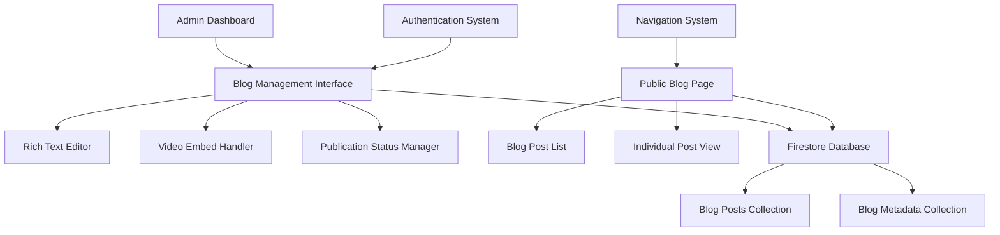

# Design Document: Admin Blog System

## Overview

The Admin Blog System provides a comprehensive content management solution integrated into the existing RPV Bible application. The system consists of two main components: an administrative interface for creating and managing blog posts, and a public-facing blog section for displaying published content. The design leverages the existing Firestore database, admin authentication system, and UI components to provide a seamless experience.

## Architecture

### High-Level Architecture



### Data Flow

1. **Content Creation Flow**: Admin → Blog Management → Rich Editor → Firestore
2. **Content Display Flow**: Public User → Blog Page → Firestore → Rendered Content
3. **Video Embedding Flow**: Admin → Video URL Input → URL Validation → Embed Code Generation → Storage

## Components and Interfaces

### Admin Components

#### BlogManagementSection
- **Purpose**: Main administrative interface for blog management
- **Location**: `src/components/admin/blog-management-section.tsx`
- **Features**:
  - Blog post list with status indicators
  - Create/Edit/Delete operations
  - Bulk actions for publication status
  - Search and filtering capabilities

#### BlogEditor
- **Purpose**: Rich text editor for creating and editing blog posts
- **Location**: `src/components/admin/blog-editor.tsx`
- **Features**:
  - Rich text formatting (headings, bold, italic, lists, links)
  - Video URL input with automatic embed generation
  - Live preview mode
  - Auto-save functionality
  - Image upload support (future enhancement)

#### BlogPostCard
- **Purpose**: Individual blog post display in admin list
- **Location**: `src/components/admin/blog-post-card.tsx`
- **Features**:
  - Post metadata display
  - Quick action buttons (edit, delete, publish/unpublish)
  - Status badges
  - Preview excerpt

### Public Components

#### BlogPage
- **Purpose**: Main public blog listing page
- **Location**: `src/app/blog/page.tsx`
- **Features**:
  - Responsive blog post grid
  - Pagination for large post lists
  - Search functionality
  - Category filtering (future enhancement)

#### BlogPostPage
- **Purpose**: Individual blog post display
- **Location**: `src/app/blog/[slug]/page.tsx`
- **Features**:
  - Full post content rendering
  - Embedded video display
  - Social sharing buttons (future enhancement)
  - Related posts suggestions (future enhancement)

#### BlogPostPreview
- **Purpose**: Blog post preview card for listings
- **Location**: `src/components/blog/blog-post-preview.tsx`
- **Features**:
  - Post title, excerpt, and metadata
  - Featured image display (future enhancement)
  - Read more link
  - Publication date formatting

### Video Embedding System

#### VideoEmbedHandler
- **Purpose**: Handles video URL processing and embed generation
- **Location**: `src/lib/video-embed-handler.ts`
- **Supported Platforms**:
  - YouTube (youtube.com, youtu.be)
  - Vimeo (vimeo.com)
  - Extensible for additional platforms

#### Video URL Processing
```typescript
interface VideoEmbedResult {
  platform: 'youtube' | 'vimeo' | 'unknown';
  embedCode: string;
  thumbnailUrl?: string;
  title?: string;
  isValid: boolean;
}
```

## Data Models

### BlogPost Interface
```typescript
interface BlogPost {
  id: string;
  title: string;
  content: string; // Rich HTML content
  excerpt: string; // Auto-generated or manual
  slug: string; // URL-friendly version of title
  author: string; // Admin user ID
  authorName: string; // Display name
  status: 'draft' | 'published' | 'archived';
  publishedAt?: Date;
  createdAt: Date;
  updatedAt: Date;
  tags?: string[]; // Future enhancement
  featuredImage?: string; // Future enhancement
  videoEmbeds: VideoEmbed[];
  seoTitle?: string; // Future enhancement
  seoDescription?: string; // Future enhancement
}

interface VideoEmbed {
  id: string;
  platform: 'youtube' | 'vimeo';
  videoId: string;
  embedCode: string;
  thumbnailUrl?: string;
  title?: string;
  position: number; // Position in content
}
```

### Firestore Collections

#### Blog Posts Collection (`/blog-posts`)
- **Document ID**: Auto-generated or slug-based
- **Security Rules**: Admin write, public read for published posts
- **Indexes**: 
  - `status` + `publishedAt` (descending)
  - `author` + `createdAt` (descending)

#### Blog Metadata Collection (`/blog-metadata`)
- **Document ID**: `settings`
- **Purpose**: Store blog configuration and settings
- **Fields**: `postsPerPage`, `allowComments`, `moderationEnabled`

## Service Layer

### BlogService
- **Location**: `src/lib/services/blog-service.ts`
- **Methods**:
  - `createPost(post: Partial<BlogPost>): Promise<BlogPost>`
  - `updatePost(id: string, updates: Partial<BlogPost>): Promise<void>`
  - `deletePost(id: string): Promise<void>`
  - `getPost(id: string): Promise<BlogPost | null>`
  - `getPublishedPosts(limit?: number, offset?: number): Promise<BlogPost[]>`
  - `getAllPosts(): Promise<BlogPost[]>` (admin only)
  - `publishPost(id: string): Promise<void>`
  - `unpublishPost(id: string): Promise<void>`

### BlogRepository
- **Location**: `src/lib/repositories/blog-repository.ts`
- **Purpose**: Firestore operations for blog data
- **Extends**: Existing repository pattern from `firestore-repository.ts`

## Navigation Integration

### Homepage Navigation Update
Add blog link to existing navigation:
```typescript
const navLinks = [
  { name: 'Read the Bible', href: '/read' },
  { name: 'AI Bible Search', href: '/bible-search' },
  { name: 'Study Tools', href: '/study' },
  { name: 'Blog', href: '/blog' }, // New addition
  { name: 'Bible Gateway Plus', href: '/plus' },
  { name: 'Bible News', href: '/news' },
  { name: 'Explore More', href: '/explore' },
  { name: 'Store', href: '/store' }
];
```

### Admin Dashboard Integration
Add blog management tab to existing admin interface:
```typescript
const adminTabs = [
  { id: 'upload', label: 'Upload & Edit' },
  { id: 'manage', label: 'Manage Publications' },
  { id: 'blog', label: 'Blog Management' } // New addition
];
```

## Rich Text Editor Implementation

### Editor Choice: TinyMCE or Quill
- **Recommendation**: TinyMCE for comprehensive features
- **Alternative**: Quill for lighter weight
- **Features Required**:
  - WYSIWYG editing
  - HTML output
  - Custom toolbar
  - Video embed plugin
  - Responsive design

### Video Embedding in Editor
```typescript
// Custom TinyMCE plugin for video embedding
const videoEmbedPlugin = {
  init: (editor: any) => {
    editor.ui.registry.addButton('videoembed', {
      text: 'Embed Video',
      onAction: () => {
        // Open video URL dialog
        // Process URL and insert embed code
      }
    });
  }
};
```

## URL Structure and Routing

### Public Routes
- `/blog` - Blog listing page
- `/blog/[slug]` - Individual blog post
- `/blog/page/[number]` - Paginated blog listing

### Admin Routes
- `/admin` - Main admin dashboard (existing)
- `/admin#blog` - Blog management section (tab-based)

## SEO and Performance Considerations

### SEO Optimization
- Automatic meta tag generation from post content
- Open Graph tags for social sharing
- Structured data markup for blog posts
- XML sitemap generation for blog posts

### Performance Optimization
- Server-side rendering for blog pages
- Image optimization for featured images
- Lazy loading for embedded videos
- Caching strategy for published posts

## Security Considerations

### Authentication and Authorization
- Admin-only access to blog management
- Role-based permissions (future: editor vs admin)
- CSRF protection for form submissions

### Content Security
- HTML sanitization for user input
- XSS prevention in rich text content
- Video URL validation and sanitization
- Rate limiting for blog operations

### Firestore Security Rules
```javascript
rules_version = '2';
service cloud.firestore {
  match /databases/{database}/documents {
    // Blog posts - admin write, public read for published
    match /blog-posts/{postId} {
      allow read: if resource.data.status == 'published' || 
                     request.auth != null && request.auth.token.admin == true;
      allow write: if request.auth != null && request.auth.token.admin == true;
    }
    
    // Blog metadata - admin only
    match /blog-metadata/{document} {
      allow read, write: if request.auth != null && request.auth.token.admin == true;
    }
  }
}
```

## Error Handling

### Client-Side Error Handling
- Form validation with user-friendly messages
- Network error recovery with retry mechanisms
- Graceful degradation for failed video embeds

### Server-Side Error Handling
- Comprehensive error logging
- Fallback content for failed operations
- Transaction rollback for data consistency

## Testing Strategy

### Unit Tests
- Blog service methods
- Video embed URL processing
- Content sanitization functions
- Form validation logic

### Integration Tests
- Admin blog management workflow
- Public blog display functionality
- Video embedding end-to-end
- Authentication and authorization

### Property-Based Tests
- Content sanitization properties
- URL slug generation properties
- Video URL validation properties

## Future Enhancements

### Phase 2 Features
- Comment system with moderation
- Category and tag management
- Featured images and media gallery
- Email notifications for new posts

### Phase 3 Features
- Multi-author support with roles
- Advanced SEO tools
- Analytics integration
- Content scheduling

### Phase 4 Features
- Multi-language blog support
- Advanced search with full-text indexing
- Social media integration
- Newsletter subscription system

## Correctness Properties

*A property is a characteristic or behavior that should hold true across all valid executions of a system-essentially, a formal statement about what the system should do. Properties serve as the bridge between human-readable specifications and machine-verifiable correctness guarantees.*

### Property 1: Blog Post Storage Integrity
*For any* blog post data with valid fields, saving the post should result in the stored data containing the original content plus automatically generated timestamp and author information
**Validates: Requirements 1.3**

### Property 2: Content Editor Loading Consistency
*For any* existing blog post, loading it in the content editor should populate all form fields with the exact values from the stored post
**Validates: Requirements 1.4**

### Property 3: Blog Post Deletion Completeness
*For any* blog post that exists in the system, deleting it should remove it completely from storage and it should no longer appear in any queries
**Validates: Requirements 1.5**

### Property 4: Video URL Processing Accuracy
*For any* valid video URL from supported platforms (YouTube, Vimeo), the system should generate syntactically correct embed code that contains the video ID
**Validates: Requirements 2.2**

### Property 5: Video Platform Support Completeness
*For any* URL from YouTube or Vimeo, the video embed handler should successfully identify the platform and extract the video ID
**Validates: Requirements 2.3**

### Property 6: Preview and Final Rendering Consistency
*For any* blog post content, the preview mode should render the same HTML output as the final public display
**Validates: Requirements 2.5**

### Property 7: Draft Post Visibility Control
*For any* blog post marked as draft, it should not appear in public blog queries but should appear in admin queries
**Validates: Requirements 3.2**

### Property 8: Published Post Visibility
*For any* blog post marked as published, it should appear in public blog queries and be accessible via its public URL
**Validates: Requirements 3.3**

### Property 9: Status Display Accuracy
*For any* blog post with a publication status, the admin dashboard display should show the correct status indicator
**Validates: Requirements 3.4**

### Property 10: Archived Post Access Control
*For any* blog post marked as archived, it should not appear in public queries but should remain accessible in admin interfaces
**Validates: Requirements 3.5**

### Property 11: Published Posts Chronological Ordering
*For any* set of published blog posts, the public blog page should display them in reverse chronological order (newest first)
**Validates: Requirements 4.2**

### Property 12: Blog Post Display Completeness
*For any* blog post displayed in the public interface, the rendered output should include title, publication date, author, and content preview
**Validates: Requirements 4.3**

### Property 13: Full Post Content Display
*For any* individual blog post page, the displayed content should include all post content including any embedded videos
**Validates: Requirements 4.4**

### Property 14: SEO-Friendly URL Generation
*For any* blog post title, the system should generate a URL slug that contains only alphanumeric characters, hyphens, and is lowercase
**Validates: Requirements 5.2**

### Property 15: Post Metadata Display Requirements
*For any* blog post display, the rendered output should include publication date and author information
**Validates: Requirements 5.3**

### Property 16: Admin Query Sorting and Filtering
*For any* admin blog post query with sorting or filtering parameters, the results should be correctly ordered and filtered according to the specified criteria
**Validates: Requirements 5.4**

### Property 17: Timestamp Audit Trail
*For any* blog post operation (create, update, delete), the system should properly set or update the relevant timestamps (createdAt, updatedAt)
**Validates: Requirements 5.5**

### Property 18: Blog Data Persistence
*For any* valid blog post data, storing it in Firestore should result in the data being retrievable with all fields intact
**Validates: Requirements 6.1**

### Property 19: Admin Authentication Enforcement
*For any* blog management operation, the system should verify that the user has administrator privileges before allowing the operation
**Validates: Requirements 6.2**

### Property 20: Input Sanitization Security
*For any* user input containing potentially malicious content (scripts, HTML), the system should sanitize it to remove security threats while preserving safe formatting
**Validates: Requirements 6.3**

### Property 21: Video URL Validation and Sanitization
*For any* video URL input, the system should validate that it's from a supported platform and sanitize the resulting embed code to prevent XSS attacks
**Validates: Requirements 6.4**