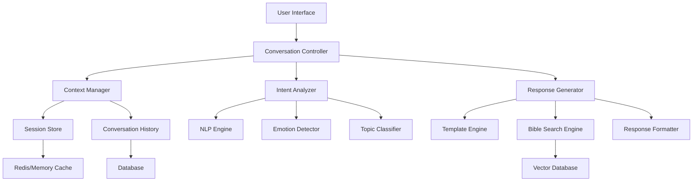

# Design Document

## Overview

This design outlines the implementation of a production-level conversational AI system for Bible search that maintains context, understands complex user intent, and generates natural, helpful responses. The system will transform the current basic search interface into an intelligent conversation partner that can engage in meaningful spiritual discussions while maintaining biblical accuracy.

## Architecture

### High-Level Architecture



### Component Interaction Flow

1. **User Input** → **Conversation Controller** (orchestrates the entire flow)
2. **Context Manager** retrieves conversation history and user preferences
3. **Intent Analyzer** processes input using NLP, emotion detection, and topic classification
4. **Response Generator** creates contextual responses using templates and Bible search
5. **Response** is formatted and returned to user interface
6. **Context Manager** updates conversation history and learns from interaction

## Components and Interfaces

### 1. Enhanced Conversation Controller

```typescript
interface ConversationController {
  processUserInput(input: UserInput): Promise<ConversationResponse>
  maintainContext(sessionId: string): Promise<ConversationContext>
  generateResponse(intent: UserIntent, context: ConversationContext): Promise<Response>
}

interface UserInput {
  text: string
  sessionId: string
  timestamp: Date
  metadata?: {
    emotionalState?: string
    urgency?: 'low' | 'medium' | 'high'
    followUp?: boolean
  }
}

interface ConversationResponse {
  text: string
  verses?: BibleVerse[]
  followUpQuestions?: string[]
  clarificationNeeded?: ClarificationRequest
  conversationState: ConversationState
  suggestions?: string[]
}
```

### 2. Advanced Context Manager

```typescript
interface ContextManager {
  getConversationHistory(sessionId: string): Promise<ConversationHistory>
  updateContext(sessionId: string, interaction: Interaction): Promise<void>
  analyzeContextualRelevance(input: string, history: ConversationHistory): ContextualRelevance
  maintainSessionState(sessionId: string): Promise<SessionState>
}

interface ConversationHistory {
  sessionId: string
  interactions: Interaction[]
  topics: TopicThread[]
  userPreferences: UserPreferences
  emotionalJourney: EmotionalState[]
}

interface Interaction {
  timestamp: Date
  userInput: string
  aiResponse: string
  verses: BibleVerse[]
  userFeedback?: 'helpful' | 'partially_helpful' | 'not_helpful'
  topicsDiscussed: string[]
  emotionalContext?: string
}

interface TopicThread {
  topic: string
  subtopics: string[]
  verses: BibleVerse[]
  userInterest: number // 0-1 scale
  lastDiscussed: Date
}
```

### 3. Intelligent Intent Analyzer

```typescript
interface IntentAnalyzer {
  analyzeIntent(input: string, context: ConversationContext): Promise<UserIntent>
  detectEmotionalState(input: string): EmotionalState
  classifyTopics(input: string): TopicClassification
  identifyFollowUpType(input: string, history: ConversationHistory): FollowUpType
}

interface UserIntent {
  primaryIntent: IntentType
  secondaryIntents: IntentType[]
  emotionalContext: EmotionalState
  topics: string[]
  complexity: 'simple' | 'moderate' | 'complex'
  requiresClarification: boolean
  referencesHistory: boolean
  practicalApplication: boolean
}

enum IntentType {
  SEEKING_COMFORT = 'seeking_comfort',
  ASKING_GUIDANCE = 'asking_guidance',
  EXPLORING_TOPIC = 'exploring_topic',
  REQUESTING_EXPLANATION = 'requesting_explanation',
  SHARING_STRUGGLE = 'sharing_struggle',
  FOLLOWING_UP = 'following_up',
  EXPRESSING_GRATITUDE = 'expressing_gratitude',
  SEEKING_ENCOURAGEMENT = 'seeking_encouragement'
}

interface EmotionalState {
  primary: string // 'anxious', 'hopeful', 'confused', 'grateful', etc.
  intensity: number // 0-1 scale
  needsComfort: boolean
  needsEncouragement: boolean
  needsGuidance: boolean
}
```

### 4. Advanced Response Generator

```typescript
interface ResponseGenerator {
  generateContextualResponse(intent: UserIntent, context: ConversationContext): Promise<GeneratedResponse>
  createFollowUpQuestions(topic: string, userLevel: string): string[]
  formatBiblicalResponse(verses: BibleVerse[], intent: UserIntent): FormattedResponse
  generateClarificationQuestions(ambiguousIntent: UserIntent): ClarificationRequest
}

interface GeneratedResponse {
  mainResponse: string
  verses: EnhancedBibleVerse[]
  explanation: string
  practicalApplication?: string
  followUpQuestions: string[]
  relatedTopics: string[]
  conversationalTone: 'pastoral' | 'educational' | 'encouraging' | 'comforting'
}

interface EnhancedBibleVerse extends BibleVerse {
  contextualRelevance: string // Why this verse addresses the user's specific need
  applicationSuggestion?: string // How to apply this verse practically
  relatedThemes: string[]
  emotionalResonance: number // 0-1 scale of emotional relevance
}
```

### 5. Session and Memory Management

```typescript
interface SessionManager {
  createSession(userId?: string): Promise<SessionState>
  updateSession(sessionId: string, updates: Partial<SessionState>): Promise<void>
  getSessionContext(sessionId: string): Promise<SessionContext>
  cleanupExpiredSessions(): Promise<void>
}

interface SessionState {
  sessionId: string
  userId?: string
  startTime: Date
  lastActivity: Date
  conversationPhase: ConversationPhase
  userProfile: UserProfile
  preferences: ConversationPreferences
}

interface UserProfile {
  spiritualMaturity: 'new' | 'growing' | 'mature'
  preferredTopics: string[]
  communicationStyle: 'direct' | 'exploratory' | 'contemplative'
  needsLevel: 'basic' | 'intermediate' | 'advanced'
  pastoralNeeds: string[]
}

enum ConversationPhase {
  INTRODUCTION = 'introduction',
  EXPLORATION = 'exploration',
  DEEPENING = 'deepening',
  APPLICATION = 'application',
  CONCLUSION = 'conclusion'
}
```

## Data Models

### Enhanced Conversation Storage

```sql
-- Conversations table with rich context
CREATE TABLE conversations (
    id UUID PRIMARY KEY,
    session_id VARCHAR(255) NOT NULL,
    user_input TEXT NOT NULL,
    ai_response TEXT NOT NULL,
    intent_analysis JSONB,
    emotional_context JSONB,
    topics_discussed TEXT[],
    verses_referenced JSONB,
    user_feedback VARCHAR(50),
    conversation_phase VARCHAR(50),
    timestamp TIMESTAMP DEFAULT NOW(),
    context_metadata JSONB
);

-- Topic threads for maintaining subject continuity
CREATE TABLE topic_threads (
    id UUID PRIMARY KEY,
    session_id VARCHAR(255) NOT NULL,
    topic VARCHAR(255) NOT NULL,
    subtopics TEXT[],
    user_interest_score DECIMAL(3,2),
    verses_explored JSONB,
    last_discussed TIMESTAMP,
    thread_depth INTEGER DEFAULT 1
);

-- User profiles for personalization
CREATE TABLE user_profiles (
    session_id VARCHAR(255) PRIMARY KEY,
    spiritual_maturity VARCHAR(50),
    preferred_topics TEXT[],
    communication_style VARCHAR(50),
    pastoral_needs TEXT[],
    conversation_preferences JSONB,
    created_at TIMESTAMP DEFAULT NOW(),
    updated_at TIMESTAMP DEFAULT NOW()
);

-- Response templates for consistent quality
CREATE TABLE response_templates (
    id UUID PRIMARY KEY,
    intent_type VARCHAR(100) NOT NULL,
    emotional_context VARCHAR(100),
    template_text TEXT NOT NULL,
    follow_up_questions TEXT[],
    usage_count INTEGER DEFAULT 0,
    effectiveness_score DECIMAL(3,2)
);
```

### Context Caching Strategy

```typescript
interface ContextCache {
  // Redis-based caching for active sessions
  activeSession: {
    key: `session:${sessionId}`,
    ttl: 1800, // 30 minutes
    data: SessionState
  },
  
  // Recent conversation history (last 10 interactions)
  recentHistory: {
    key: `history:${sessionId}`,
    ttl: 3600, // 1 hour
    data: Interaction[]
  },
  
  // User preferences and profile
  userProfile: {
    key: `profile:${sessionId}`,
    ttl: 86400, // 24 hours
    data: UserProfile
  },
  
  // Topic threads and interests
  topicThreads: {
    key: `topics:${sessionId}`,
    ttl: 7200, // 2 hours
    data: TopicThread[]
  }
}
```

## Correctness Properties

*A property is a characteristic or behavior that should hold true across all valid executions of a system-essentially, a formal statement about what the system should do. Properties serve as the bridge between human-readable specifications and machine-verifiable correctness guarantees.*

### Property 1: Context Continuity Preservation
*For any* conversation session, when a user references previous content ("that verse", "what we discussed"), the system should correctly identify and retrieve the referenced information from conversation history
**Validates: Requirements 1.2, 1.4**

### Property 2: Intent Understanding Accuracy
*For any* user input expressing emotional distress or spiritual need, the system should correctly identify the underlying intent and respond with appropriate pastoral sensitivity
**Validates: Requirements 3.1, 3.2, 9.1**

### Property 3: Response Contextual Relevance
*For any* generated response, all included Bible verses should have clear contextual relevance explanations that connect to the user's specific situation and needs
**Validates: Requirements 4.1, 4.2, 7.1**

### Property 4: Conversation Flow Coherence
*For any* multi-turn conversation, each AI response should build logically on previous exchanges while maintaining topical coherence and advancing understanding
**Validates: Requirements 2.1, 2.2, 2.5**

### Property 5: Session Memory Persistence
*For any* conversation session, context and preferences should be maintained consistently across interactions until session expiration or explicit reset
**Validates: Requirements 1.1, 1.5, 5.1**

### Property 6: Clarification Intelligence
*For any* ambiguous user query, clarifying questions should demonstrate understanding of multiple possible interpretations and guide users toward more specific exploration
**Validates: Requirements 6.1, 6.2, 6.5**

### Property 7: Emotional Response Appropriateness
*For any* user input expressing emotional distress, the system response should include appropriate comfort, relevant verses, and pastorally sensitive guidance
**Validates: Requirements 9.1, 9.2, 9.4**

### Property 8: Learning Adaptation Effectiveness
*For any* user feedback or preference indication, the system should incorporate this information to improve future responses within the same session
**Validates: Requirements 10.1, 10.2, 10.5**

### Property 9: Natural Language Processing Robustness
*For any* user input with colloquial language, typos, or informal expression, the system should understand intent and respond appropriately without requiring formal religious terminology
**Validates: Requirements 8.1, 8.2, 8.4**

### Property 10: Response Integration Completeness
*For any* complex topic with multiple biblical perspectives, the response should integrate relevant passages thematically with clear explanations and logical organization
**Validates: Requirements 7.1, 7.2, 7.5**

## Error Handling

### Graceful Degradation Strategy

1. **Context Loss Recovery**: If session context is lost, gracefully re-establish context by asking clarifying questions
2. **Intent Ambiguity Handling**: When intent cannot be determined, provide multiple interpretation options
3. **Search Failure Fallback**: If Bible search fails, provide general comfort verses and explanation
4. **Response Generation Failure**: Fall back to template-based responses with apology and retry option
5. **Session Timeout Management**: Offer to restore previous conversation or start fresh

### Error Response Templates

```typescript
const errorResponses = {
  contextLost: "I apologize, but I seem to have lost track of our conversation. Could you help me understand what you'd like to explore?",
  searchFailure: "I'm having trouble finding specific verses right now, but I'd like to offer you this encouragement from Philippians 4:6-7...",
  intentUnclear: "I want to make sure I understand what you're looking for. Are you seeking comfort, guidance, or exploring a particular topic?",
  systemError: "I'm experiencing some technical difficulties. Let me try to help you in a simpler way..."
}
```

## Testing Strategy

### Unit Testing Approach
- **Context Manager**: Test conversation history retrieval and context maintenance
- **Intent Analyzer**: Test emotional state detection and topic classification accuracy
- **Response Generator**: Test response quality and biblical accuracy
- **Session Manager**: Test session lifecycle and cleanup

### Property-Based Testing Configuration
- **Minimum 100 iterations** per property test
- **Test data generation** for various conversation scenarios
- **Emotional context simulation** for pastoral sensitivity testing
- **Multi-turn conversation simulation** for context preservation testing

### Integration Testing
- **End-to-end conversation flows** testing complete user journeys
- **Context persistence testing** across session boundaries
- **Response quality evaluation** using human feedback simulation
- **Performance testing** under concurrent conversation load

### Property Test Examples

```typescript
// Property 1: Context Continuity Preservation
describe('Context Continuity', () => {
  it('should maintain reference resolution across conversation turns', async () => {
    // Generate random conversation with references
    const conversation = generateConversationWithReferences();
    for (const turn of conversation.turns) {
      const response = await conversationController.processUserInput(turn.input);
      if (turn.hasReference) {
        expect(response.resolvedReferences).toBeDefined();
        expect(response.resolvedReferences.length).toBeGreaterThan(0);
      }
    }
  });
});

// Property 7: Emotional Response Appropriateness  
describe('Emotional Intelligence', () => {
  it('should provide appropriate comfort for distressed users', async () => {
    const distressInputs = generateDistressedUserInputs();
    for (const input of distressInputs) {
      const response = await conversationController.processUserInput(input);
      expect(response.conversationalTone).toBe('comforting');
      expect(response.verses.some(v => v.emotionalResonance > 0.7)).toBe(true);
      expect(response.text).toMatch(/comfort|peace|hope|strength/i);
    }
  });
});
```

This design provides a comprehensive foundation for building a production-level conversational AI that can engage users in meaningful spiritual conversations while maintaining biblical accuracy and pastoral sensitivity.